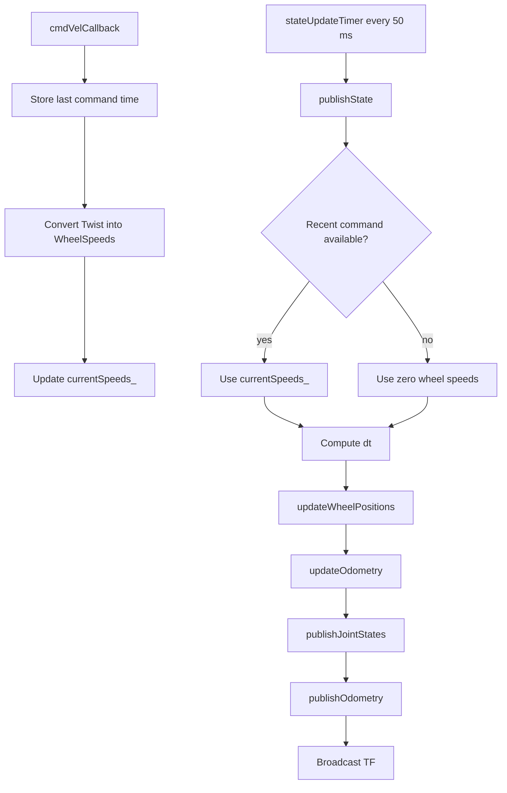
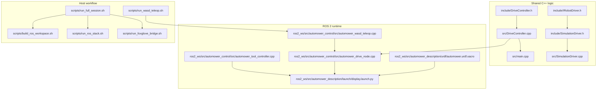
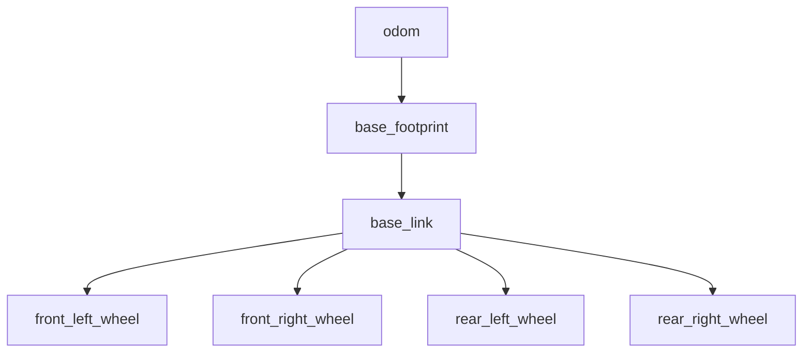
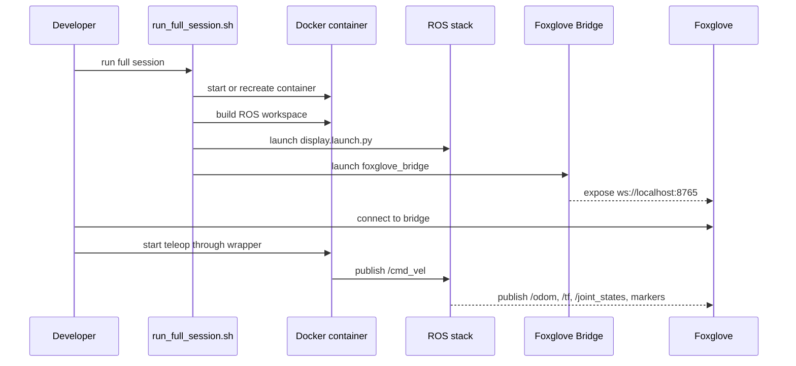

# System Diagrams

This file collects visual diagrams for the current `autoMower` architecture.

Use it together with `docs/learning-guide.md` when you want a quick visual map before reading source code.

## 1. End-to-End Runtime Flow

```mermaid
flowchart LR
    User[Operator keyboard input]
    Wrapper[run_wasd_teleop.sh]
    Teleop[automower_wasd_teleop.cpp]
    CmdVel[/cmd_vel]
    Mode[/work_mode and /emergency_stop]
    DriveNode[automower_drive_node.cpp]
    Controller[DriveController]
    State[Internal motion state\ncurrentSpeeds x y yaw wheel positions]
    ToolCmd[/tool_profile /tool_enabled\n/tool_power /tool_angle]
    ToolNode[automower_tool_controller.cpp]
    JointStates[/joint_states]
    Odom[/odom]
    TF[/tf: odom -> base_footprint]
    Markers[/visualization_marker_array]
    Foxglove[Foxglove 3D view]

    User --> Wrapper
    Wrapper --> Teleop
    Teleop --> CmdVel
    Mode --> DriveNode
    CmdVel --> DriveNode
    DriveNode --> Controller
    Controller --> State
    ToolCmd --> ToolNode
    State --> JointStates
    State --> Odom
    State --> TF
    State --> Markers
    JointStates --> Foxglove
    Odom --> Foxglove
    TF --> Foxglove
    Markers --> Foxglove
```

## 2. What The Control Node Does



## 3. File Responsibility Map



## 4. Topic And Frame View

```mermaid
flowchart LR
    Teleop[Teleop node] -->|publishes| CmdVel[/cmd_vel]
    ModeTools[Mode and tool scripts] -->|publish| WorkMode[/work_mode]
    ModeTools -->|publish| EStop[/emergency_stop]
    ModeTools -->|publish| ToolProfile[/tool_profile]
    ModeTools -->|publish| ToolEnabled[/tool_enabled]
    ModeTools -->|publish| ToolPower[/tool_power]
    ModeTools -->|publish| ToolAngle[/tool_angle]
    Drive[Drive node] -->|publishes| Joint[/joint_states]
    Drive -->|publishes| Odom[/odom]
    Drive -->|broadcasts| TF[/tf]
    ToolController[Tool controller] -->|interprets| ToolStatus[Tool state]
    RobotStatePublisher[robot_state_publisher] -->|broadcasts| TFStatic[/tf_static]
    URDF[/robot_description/] --> RobotStatePublisher
    WorkMode --> Drive
    EStop --> Drive
    WorkMode --> ToolController
    EStop --> ToolController
    ToolProfile --> ToolController
    ToolEnabled --> ToolController
    ToolPower --> ToolController
    ToolAngle --> ToolController
    Joint --> Foxglove[Foxglove]
    Odom --> Foxglove
    TF --> Foxglove
    TFStatic --> Foxglove
```



## 5. Development Workflow



## How To Use These Diagrams

- Start with the end-to-end runtime flow when you want to understand the big picture.
- Use the control-node diagram when reading `automower_drive_node.cpp`.
- Use the file responsibility map when deciding where to make a code change.
- Use the topic and frame view when Foxglove or TF looks wrong.
